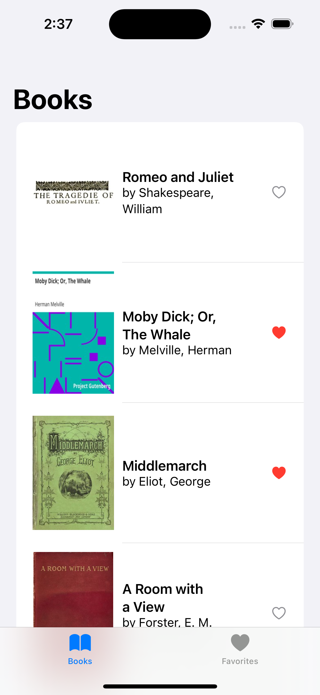
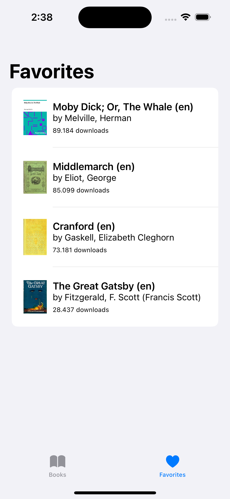

MyBooks
==
This is a simple iOS app that displays a list of books and allows users to mark their favorites. 
The app utilizes the Gutendex public API to fetch book data and demonstrates asynchronous programming using SwiftUI and Combine.

## Purpose
Get familiar with SwiftUI and Combine.

> **Note**
> The main focus of this project was the aforementioned technologies. Thus, algorythms implemented in suboptimal version.

# Screenshots

Book List             |  Favorite List
:-------------------------:|:-------------------------:
  |  


# Installation
1. Clone the repository: `git clone git@github.com:stelarelas/MyBooks.git`
2. Open the project in Xcode.
3. Build and run the app on a simulator or device.


# Dependencies
The app has the following dependencies:

- SwiftUI: A declarative framework for building user interfaces.
- Combine: A framework for processing values over time.
- URLSession: Apple's networking framework for making HTTP requests.


# Technical Info

## Design overview
The app follows the MVVM (Model-View-ViewModel) architectural pattern.

- **Data models**: `BookListRaw`, `ResultRaw`, `Book`
  - Represents the book entity and the response structure for book lists.
    
    ```swift
    struct Book: Identifiable, Decodable {
        let id: Int
        let title: String
        let author: String
        let coverImageURL: URL?
        var isFavorite: Bool = false
        let languages: String
        let downloadCount: Int
    }
    ```

- **View Models**: `BookListViewModel`, `FavoriteListViewModel`
  - Handles the data and business logic for the book list and favorite list screens.
  - Communicates with the data service to fetch and update book data.

    ```swift
    class BookListViewModel: ObservableObject {
        @Published var books: [Book] = []
        private var subscribers: Set<AnyCancellable> = []
        private var booksService: BooksServiceProtocol
        private var nextPage: String?
    
        init(booksService: BooksServiceProtocol = BooksService()) {
            self.booksService = booksService
        }
    
        func fetchBooks() {
            let bookList = booksService.fetchBooks()
            saveNextPageURL(bookList: bookList)
            saveBookList(bookList: bookList)
        }
    
        func fetchMoreBooks() {
            guard let nextPage = self.nextPage else { return }
        
            let bookList = booksService.fetchMoreBooks(nextPage: nextPage)
            saveNextPageURL(bookList: bookList)
            saveBookList(bookList: bookList)
        }
    
        private func saveNextPageURL(bookList: AnyPublisher<BookListRaw, NetworkError>) {
            // Save next page URL
        }
    
        private func saveBookList(bookList: AnyPublisher<BookListRaw, NetworkError>) {
            // Save Book list
        }
    
        func toggleFavorite(book: Book) {
            if let index = books.firstIndex(where: { $0.id == book.id }) {
                books[index].isFavorite.toggle()
            }
        }
    }
    ```

    ```swift
    class FavoriteListViewModel: ObservableObject {
        @Published var favoriteBooks: [Book] = []

        func updateFavoriteBooks(from books: [Book]) {
            favoriteBooks = books.filter { $0.isFavorite }
        }
    }
    ```

- **Views**: `ContentView`, `BookListView`, `FavoriteListView`, `CoverPageView`
  - Defines the user interface components using SwiftUI.
  - Observes and interacts with the view models to display data and respond to user actions with Combine.

    ```swift
    struct ContentView: View {
        @ObservedObject private var bookListViewModel = BookListViewModel()
        @ObservedObject private var favoriteListViewModel = FavoriteListViewModel()
    
        var body: some View {
            TabView {
                BookListView(viewModel: bookListViewModel, favoriteListViewModel: favoriteListViewModel)
                    .tabItem {
                        Label("Books", systemImage: "book")
                    }

                FavoriteListView(viewModel: favoriteListViewModel)
                    .tabItem {
                        Label("Favorites", systemImage: "heart.fill")
                    }
            }
            .onAppear() {
                bookListViewModel.fetchBooks()
            }
        }
    }
    ```

- **Services**: `BooksService`, `BooksServiceProtocol`
  - Provides a network service to fetch book data using the Gutendex API.
  - Implements the BooksServiceProtocol to define the required methods.

    ```swift
    protocol BooksServiceProtocol {
        func fetchBooks() -> AnyPublisher<BookListRaw, NetworkError>
        func fetchMoreBooks(nextPage: String) -> AnyPublisher<BookListRaw, NetworkError>
    }
    ```

    ```swift
    class BooksService: BooksServiceProtocol {
        private var networkRequest: Requestable
    
        init(networkRequest: Requestable = NetworkRequest()) {
            self.networkRequest = networkRequest
        }
    
        func fetchBooks() -> AnyPublisher<BookListRaw, NetworkError> {
            // Use NetworkRequest instance to fetch books
        }
    
        func fetchMoreBooks(nextPage: String) -> AnyPublisher<BookListRaw, NetworkError> {
            // Use NetworkRequest instance to fetch the next page
        }
    }
    ```

- **Networking**: `Endpoint`, `NetworkError`, `Request`, `URLSessionProtocol`,  `Requestable`, `NetworkRequest`
  - Handles network requests and responses using Combine's URLSession publisher.
  - Performs API calls to the Gutendex API and returns publishers for book data.

    ```swift
    protocol Requestable {
        func request<T: Decodable>(_ req: Request) -> AnyPublisher<T, NetworkError>
    }

    class NetworkRequest: Requestable {
        private let session: URLSessionProtocol
        
        init(session: URLSessionProtocol = URLSession.shared) {
            self.session = session
        }
        
        public func request<T>(_ req: Request) -> AnyPublisher<T, NetworkError>
        where T: Decodable {
            
            guard let url = req.getURLRequest() else {
                // Return a fail publisher if the url is invalid
                return AnyPublisher(
                    Fail<T, NetworkError>(error: NetworkError.badURL("Invalid Url"))
                )
            }
            
            return session.getPublisher(for: url)
                .tryMap { output in
                    // throw an error if response is nil
                    guard output.response is HTTPURLResponse else {
                        throw NetworkError.serverError(code: 0, error: "Server error")
                    }
                    return output.data
                }
                .decode(type: T.self, decoder: JSONDecoder())
                .mapError { error in
                    // return error if json decoding fails
                    NetworkError.invalidJSON(String(describing: error))
                }
                .eraseToAnyPublisher()
        }
    }
    ```

- **Dependency Inversion**: Objects like `NetworkRequest` and `BooksService` containing business logic depend on interfaces/protocols
  - Mock objects have been used to test such objects

    ```swift
    class NetworkRequestMock: Requestable {
        var responseMock: AnyPublisher<BookListRaw, NetworkError>!

        func request<T>(_ req: Request) -> AnyPublisher<T, NetworkError> where T : Decodable {
            if let booksResponse = responseMock as? AnyPublisher<T, NetworkError> {
                return booksResponse
            }

            fatalError("Missing booksResponse in NetworkRequestMock")
        }
    }
    ```

- **Pagination**: When the User scrolls to the bottom of the list, the view informs the view model to fetch the next page of books. I chose to build the next page URL using the Query Params to maintain abstraction in my Networking models.


## Acknowledgements
MyBooks App utilizes the Gutendex API (https://gutendex.com/) to fetch book data.
